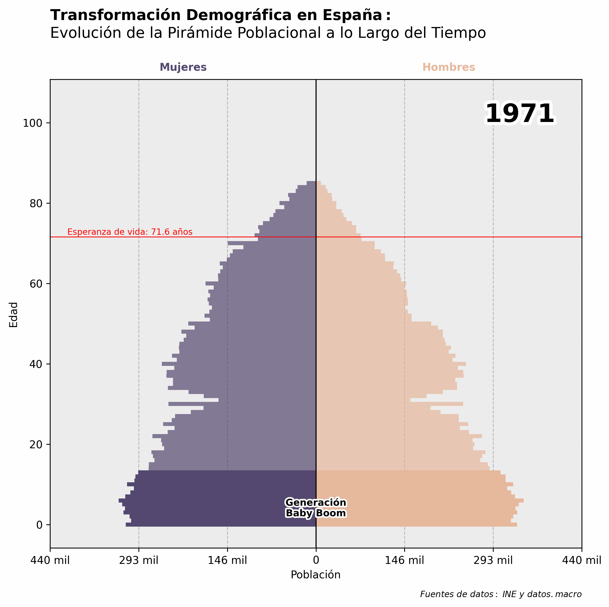
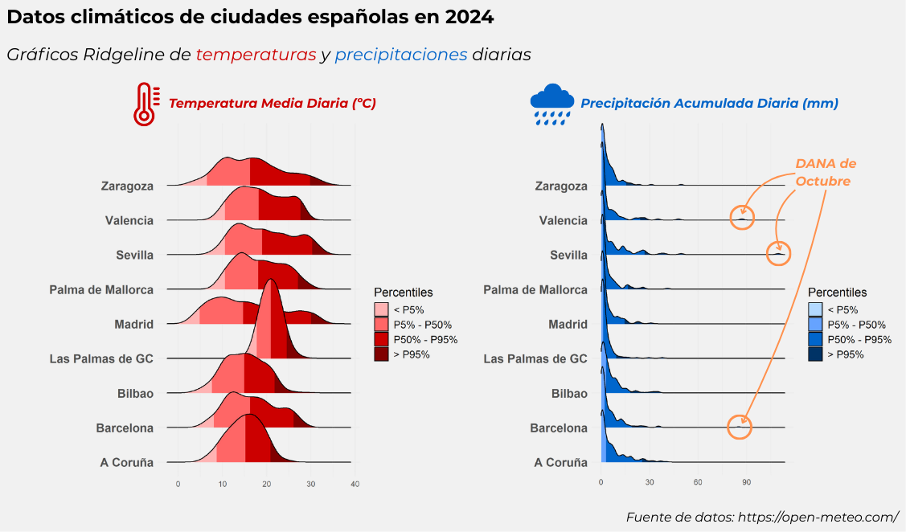

# PEC2 - VISUALIZACIÓN DE DATOS 📊📈

M2.859 · Visualización de datos · PEC2

2024-2 · Máster universitario en Ciencia de datos (Data science)

Estudios de Informática, Multimedia y Telecomunicación

&nbsp;

## Contenido

- [1. Pyramid Chart](#1-pyramid-chart)
  - [Explicación de la técnica](#explicación-de-la-técnica)
  - [Datos y herramientas usadas para la propuesta](#datos-y-herramientas-usadas-para-la-propuesta)
  - [Propuesta de la técnica](#propuesta-de-la-técnica)
- [2. Stream Graph](#2-stream-graph)
  - [Explicación de la técnica](#explicación-de-la-técnica-1)
  - [Datos y herramientas usadas para la propuesta](#datos-y-herramientas-usadas-para-la-propuesta-1)
  - [Propuesta de la técnica](#propuesta-de-la-técnica-1)
- [3. Ridgeline Chart](#3-ridgeline-chart)
  - [Explicación de la técnica](#explicación-de-la-técnica-2)
  - [Datos y herramientas usadas para la propuesta](#datos-y-herramientas-usadas-para-la-propuesta-2)
  - [Propuesta de la técnica](#propuesta-de-la-técnica-2)

-----------

## 1. Pyramid Chart

### Explicación de la técnica

<table class="tabla-visualizacion">
  <tr>
    <td class="col-titulo"><b>1. Origen y Autoría</b></td>
    <td>Herramienta gráfica utilizada en el campo de la sociología para mostrar la distribución de diversos grupos de edad en una población. También es usada en el campo de la ecología para determinar la distribución de edades de una población. Las fuentes proporcionadas no especifican una autoría concreta para esta técnica.</td>
  </tr>
  <tr>
    <td class="col-titulo"><b>2. Características Principales</b></td>
    <td>
      - Consiste en dos histogramas colocados espalda con espalda que muestran la distribución de una población en todos los grupos de edad y ambos sexos. 
      - El eje horizontal representa el número de población, mientras que el eje vertical enumera todos los grupos de edad.
    </td>
  </tr>
  <tr>
    <td class="col-titulo"><b>3. Tipos de Datos Admitidos</b></td>
    <td>- Datos demográficos que incluyen género (dato cualitativo), edad (dato cuantitativo) y tamaño de la población (dato cuantitativo).</td>
  </tr>
  <tr>
    <td class="col-titulo"><b>4. Ventajas</b></td>
    <td>
      - Permite detectar cambios o diferencias en los patrones de población. 
      - Facilita la comparación de patrones entre naciones o grupos de población seleccionados.
    </td>
  </tr>
  <tr>
    <td class="col-titulo"><b>5. Inconvenientes</b></td>
    <td>- Puede ser menos efectivo si se compara con otros gráficos que muestran cambios en la población a lo largo del tiempo.</td>
  </tr>
  <tr>
    <td class="col-titulo"><b>6. Ejemplos y Aplicaciones Habituales</b></td>
    <td>
      - Análisis demográficos para planificar políticas públicas. 
      - Estudios de mercado que requieren comprensión de la estructura poblacional.
    </td>
  </tr>
</table>

### Datos y herramientas usadas para la propuesta

Los datos utilizados en esta visualización provienen de dos fuentes: el [INE](https://www.ine.es/jaxiT3/Tabla.htm?t=56934) para la población y [datos.macro](https://datosmacro.expansion.com/demografia/esperanza-vida/espana) para la esperanza de vida.

Herramientas usadas: 

<!--Python--->

### Propuesta de la técnica

      

## 2. Stream Graph

### Explicación de la técnica

<table class="tabla-visualizacion">
  <tr>
    <td class="col-titulo"><b>1. Origen y Autoría</b></td>
    <td>El gráfico Stream tiene origen como una variación del gráfico de áreas apiladas y fue desarrollado por Lee Byron.</td>
  </tr>
  <tr>
    <td class="col-titulo"><b>2. Características Principales</b></td>
    <td>
      - Representa datos cuantitativos a lo largo del tiempo. 
      - Las áreas que representan diferentes categorías fluyen alrededor de un eje central variable, creando una apariencia similar a una corriente.
    </td>
  </tr>
  <tr>
    <td class="col-titulo"><b>3. Tipos de Datos Admitidos</b></td>
    <td>- Datos temporales (dato cuantitativo) que involucran múltiples categorías o series (dato cualitativo), especialmente cuando se desea mostrar la evolución y proporción de cada categoría en relación con el total a lo largo del tiempo.</td>
  </tr>
  <tr>
    <td class="col-titulo"><b>4. Ventajas</b></td>
    <td>
      - Permite visualizar la evolución de múltiples variables a lo largo del tiempo de manera estética y atractiva. 
      - Buena opción para mostrar tendencias y patrones cambiantes en datos de alto volumen.
    </td>
  </tr>
  <tr>
    <td class="col-titulo"><b>5. Inconvenientes</b></td>
    <td>
      - Puede sufrir problemas de legibilidad, especialmente con conjuntos de datos grandes donde las categorías con valores más pequeños pueden quedar eclipsadas por las más grandes. 
      - Es difícil leer valores exactos debido a la falta de un eje de referencia claro.
    </td>
  </tr>
  <tr>
    <td class="col-titulo"><b>6. Ejemplos y Aplicaciones Habituales</b></td>
    <td>
      - Análisis de tendencias en datos categóricos a lo largo del tiempo. 
      - Visualización de patrones estacionales o periódicos en diversos campos como economía y sociología.
    </td>
  </tr>
</table>

### Datos y herramientas usadas para la propuesta

Los datos utilizados en esta visualización provienen del repositorio de Kaggle de [Kaggle - Most Popular Programming Languages since 2004](https://www.kaggle.com/datasets/muhammadkhalid/most-popular-programming-languages-since-2004).

Herramientas usadas: 

<!--JavaScript--->

### Propuesta de la técnica

Enlace a la visualización: https://albertgallegojimenez.github.io/pec2-dataviz/

## 3. Ridgeline Chart

### Explicación de la técnica

<table class="tabla-visualizacion">
  <tr>
    <td class="col-titulo"><b>1. Origen y Autoría</b></td>
    <td>El gráfico Ridgeline es una técnica de visualización que permite comparar múltiples distribuciones de datos superpuestas, facilitando la comparación entre ellas. Originalmente, este tipo de gráfico fue popularizado bajo el nombre de "Joyplot" en referencia a la banda Joy Division, cuya portada del álbum "Unknown Pleasures" presentaba una visualización similar. Sin embargo, debido a las connotaciones históricas del nombre "Joy Division", Claus O. Wilke, profesor de Biología Integrativa, propuso en 2017 cambiar el término a "Ridgeline Plot" para evitar asociaciones inapropiadas (Wilke, 2017).</td>
  </tr>
  <tr>
    <td class="col-titulo"><b>2. Características Principales</b></td>
    <td>
      - Visualiza distribuciones de varias variables numéricas mediante una serie de curvas de densidad apiladas en el eje Y. 
      - Cada curva representa la distribución de una variable o subconjunto de datos, permitiendo comparaciones directas.
    </td>
  </tr>
  <tr>
    <td class="col-titulo"><b>3. Tipos de Datos Admitidos</b></td>
    <td>- Datos numéricos con distribuciones en diferentes categorías o momentos en el tiempo.</td>
  </tr>
  <tr>
    <td class="col-titulo"><b>4. Ventajas</b></td>
    <td>
      - Buena opción para comparar múltiples distribuciones en un solo gráfico. 
      - Puede ser usado para identificar tendencias en los datos o patrones estacionales.
    </td>
  </tr>
  <tr>
    <td class="col-titulo"><b>5. Inconvenientes</b></td>
    <td>- Puede volverse confuso si hay demasiadas categorías superpuestas.</td>
  </tr>
  <tr>
    <td class="col-titulo"><b>6. Ejemplos y Aplicaciones Habituales</b></td>
    <td>
      - Evolución de temperaturas: Distribución de temperaturas diarias a lo largo de décadas. 
      - Análisis financiero: Variabilidad de retornos en distintos mercados.
    </td>
  </tr>
</table>

### Datos y herramientas usadas para la propuesta

Los datos utilizados en esta visualización provienen de la página de [Open Meteo](https://open-meteo.com/).

Herramientas usadas: 

<!--R--->
<!--Canva--->

### Propuesta de la técnica

      

